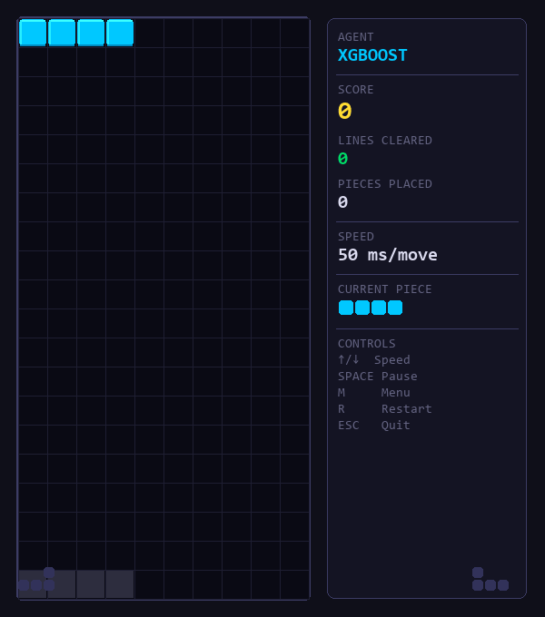
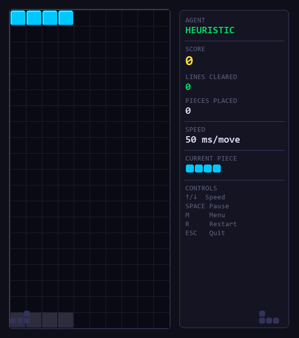
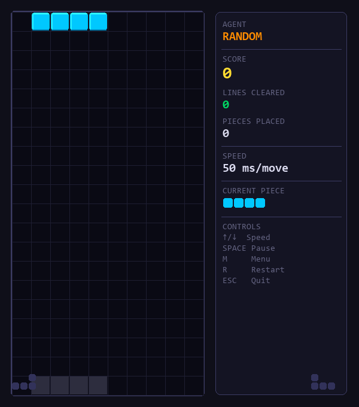

# Tetris AI: XGBoost-Based Game Playing Agent

<p align="center">
  
  
  
  
  
</p>

<p align="center">
  🌐 <b>English</b> | <a href="README_VN.md">Vietnamese</a>
</p>

## Demo

<table align="center">
  <tr>
    <td align="center"><b>XGBoost Agent</b><br>(Trained ML Model)</td>
    <td align="center"><b>Heuristic Agent</b><br>(Expert Oracle)</td>
    <td align="center"><b>Random Agent</b><br>(Baseline)</td>
  </tr>
  <tr>
    <td></td>
    <td></td>
    <td></td>
  </tr>
</table>

## Project Overview

This project teaches an AI to play Tetris by having it "watch and learn" from an expert, rather than forcing it to play millions of games through trial and error (like traditional Reinforcement Learning).

Instead of looking at raw pixels on the screen, our AI (**XGBoost**) analyzes the board geometrically: *"Does this move create a lot of holes? Will it clear multiple lines? Is the surface too bumpy?"* 

By extracting these spatial features from just 200 games played by a mathematical algorithm, the AI successfully figures out the underlying logic and learns to play incredibly well on its own!

---

## Technical Architecture & Methodology

### 1. State Representation & Action Space
Instead of learning a policy over directional inputs (`LEFT`, `RIGHT`, `DROP`), the agent operates on **Candidate Placements**. For a given falling tetromino, the environment computes all terminal resting states (rotations + column shifts).
The agent then evaluates the *resulting board state* of each candidate.

### 2. Feature Extraction
For every candidate board state, the following 12 topological features are computed in $O(N)$ time:
- `landing_height`: The height at which the piece is placed.
- `lines_cleared`: Number of lines eliminated by this move.
- `row_transitions` / `col_transitions`: Measures of board fragmentation.
- `holes` / `wells`: Number of enclosed empty spaces and deep narrow valleys.
- `cumulative_wells`: Weighted well depths penalizing deep traps.
- `hole_depth`: How deeply buried the holes are.
- `bumpiness`: The variance of column heights.

### 3. Model Training
- **Data Generation:** The `HeuristicAgent` (acting as the Oracle) plays games to generate state-action pairs.
- **Target Value:** The evaluation score of the candidate move as computed by the Oracle.
- **Algorithm:** `XGBoost Regressor` trains on the flattened feature vectors to predict the Oracle's score.

---

## Evaluation & Results

The XGBoost model successfully captures ~85% of the performance capability of the handcrafted mathematical formula, proving the effectiveness of the selected features.

<p align="center">
  
  
</p>

*Left: Box plot showing the XGBoost model dramatically outperforming the random baseline and closely mimicking the Heuristic Oracle. Right: Feature importance indicating that `holes` and `bumpiness` are the most critical factors for survival.*

---

## Quick Start

### 1. Installation
Clone the repository and install dependencies using Conda:
```bash
git clone https://github.com/tuyenda2011/Tetris-AI-XGBoost-Based-Game-Playing-Agent.git
cd Tetris-AI-XGBoost-Based-Game-Playing-Agent
conda create -n tetris python=3.10 -y
conda activate tetris
pip install -r requirements.txt
```

### 2. The Complete Pipeline
Run the entire ML pipeline (Data Generation $\rightarrow$ Training $\rightarrow$ Evaluation):
```bash
# 1. Generate training dataset (Parallel processing)
python scripts/generate_dataset.py --config configs/dataset_quality.yaml

# 2. Train the XGBoost model
python scripts/train_model.py --config configs/model_train.yaml

# 3. Evaluate parallelly across 20 random seeds
python scripts/evaluate_agent.py --episodes 20 --max-pieces 2000 --seed 42
```

### 3. Play & Watch
Launch the interactive Pygame GUI to watch the agents play in real-time:
```bash
python scripts/play_gui.py
```
*(Controls: `UP`/`DOWN` to select agent, `ENTER` to start, `SPACE` to pause, `M` for menu, `ESC` to quit)*
