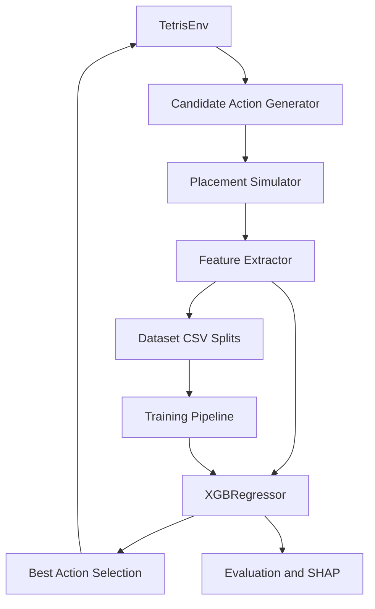

# Tetris AI - XGBoost-Based Game Playing Agent

An Advanced Machine Learning project that trains an XGBoost model to choose
Tetris actions from engineered board-state features.

This is an Advanced Machine Learning project based on supervised learning and
gradient boosting, not a Reinforcement Learning implementation. It does not use
DQN, DDQN, PPO, policy gradients, or raw-image observations as the main method.

## Project Overview

The agent evaluates every legal hard-drop placement for the current tetromino.
Each candidate action is simulated, converted into a feature vector, scored by
an XGBoost regressor, and the highest-scoring action is executed.

```text
Tetris Game State
       |
Generate Candidate Actions
       |
Simulate Candidate Actions
       |
Feature Engineering
       |
XGBoost Regressor
       |
Predict Action Quality
       |
Select Best Action
```

## Motivation

Tetris is often presented as a Reinforcement Learning problem. This project
deliberately studies another route: can a supervised gradient-boosted tree model
learn useful action-quality estimates from compact, interpretable board
features?

## Problem Definition

Research question:

**Can an XGBoost model learn to select high-quality Tetris actions from
engineered board-state features?**

The supervised target is:

```text
quality(state, action)
```

At inference time, the agent computes:

```text
argmax_action predicted_quality(state, action)
```

The analysis should answer:

- Which engineered features are most important?
- Does XGBoost outperform the Random Agent baseline?
- Does the model generalize across unseen random seeds?
- Does prediction quality correlate with actual game performance?
- In which states does the model make poor decisions?
- How much does feature engineering affect performance?

## Architecture



The code separates environment mechanics, candidate generation, feature
engineering, dataset creation, model training, agent decisions, evaluation, and
visualization.

## Environment

The repository includes a small Gymnasium-style fallback Tetris environment in
`src/environment.py`. It exposes `reset()` and `step()` and uses high-level
placement actions: rotation plus horizontal position followed by a hard drop.

This design keeps the project runnable from a clean clone. If a compatible
external environment such as `tetris-gymnasium` is available, the adapter layer
can be extended without changing the model, feature, or evaluation modules.

## Feature Engineering

Feature extraction lives in `src/features.py`. The model never consumes raw
images. It receives interpretable board features:

- aggregate height
- maximum and minimum column height
- number of holes
- bumpiness
- occupied cells
- cleared lines
- wells
- landing height
- height variance
- row density
- column density
- adjacent column height differences

These features describe risk, surface roughness, line-clear opportunity, and
future placement flexibility.

## Candidate Action Generation

For each state, `src/actions.py`:

1. Reads the active tetromino.
2. Enumerates unique rotations.
3. Enumerates legal horizontal positions.
4. Simulates a hard-drop placement.
5. Extracts features from the resulting board.
6. Returns all legal candidate actions.

The XGBoost agent never chooses a random move during inference. It scores all
legal candidates and selects the highest predicted quality.

## Dataset Generation

`src/dataset.py` creates a supervised dataset where each row is one candidate
action:

```text
current episode/piece index
+ candidate rotation and x position
+ engineered features after simulated placement
+ target_quality
```

By default, `target_quality` is a rollout/lookahead pseudo-label. For every
candidate from the same decision point, the generator samples the same short
future tetromino sequence, places future pieces greedily with a heuristic oracle,
and scores the candidate from realized line clears plus the final rollout board
quality. This avoids making the target a direct algebraic copy of the feature
row.

An immediate heuristic target is still available with `--target-mode immediate`
for debugging, but it is intentionally not the default because it is too easy for
tree models to learn.

This remains supervised learning from pseudo-labels, not Reinforcement Learning.

To reduce leakage, train/validation/test splitting is grouped by
`episode + piece_index`, so candidates generated from the same decision point do
not appear across different splits.

## XGBoost Model

The main model is `XGBRegressor`. The default training command uses explicit
non-default hyperparameters:

- `n_estimators`
- `max_depth`
- `learning_rate`
- `subsample`
- `colsample_bytree`
- `min_child_weight`
- `reg_alpha`
- `reg_lambda`

A bounded randomized search is available through `--tune`, keeping experiments
small enough for a personal machine.

## Training Pipeline

Generate data:

```bash
python scripts/generate_dataset.py --config configs/dataset_quality.yaml
```

Command-line flags can override YAML values for quick experiments, for example
`--episodes 20 --output-dir data/processed_debug`.

Train baseline and XGBoost models:

```bash
python scripts/train_model.py --seed 42
```

Run bounded tuning:

```bash
python scripts/train_model.py --tune --n-iter 12 --cv-folds 3 --seed 42
```

Training outputs are written to `models/`.

## Agent Decision Process

The project includes:

- `RandomAgent`: uniform-random legal placement baseline
- `HeuristicAgent`: greedy pseudo-label oracle for sanity checks and dataset behavior
- `XGBoostAgent`: model-based candidate scorer

The XGBoost agent:

1. Generates all legal candidate placements.
2. Builds a feature matrix.
3. Predicts action quality for every candidate.
4. Executes the candidate with the highest prediction.

## Evaluation

Evaluation uses game-level metrics, not classification accuracy:

- average score
- median score
- maximum score
- score standard deviation
- lines cleared
- pieces placed
- survival time
- confidence interval where applicable

Compare Random vs XGBoost:

```bash
python scripts/evaluate_agent.py --episodes 10 --max-pieces 120 --seed 42
```

Artifacts are written to:

- `results/metrics/`
- `results/figures/`
- `results/shap/`

## Results

This repository does not include fabricated performance claims. Run the commands
above to generate actual metrics on your machine. After evaluation, inspect:

- `results/metrics/comparison_summary.csv`
- `results/metrics/random_summary.csv`
- `results/metrics/xgboost_summary.csv`
- `results/figures/performance_comparison.png`
- `results/figures/score_distribution.png`
- `results/figures/lines_cleared_distribution.png`

## SHAP / Explainability

If `shap` is installed, evaluation can save SHAP artifacts that explain how
features push candidate-action predictions up or down:

```bash
python scripts/evaluate_agent.py --episodes 10 --skip-shap
```

Remove `--skip-shap` to produce:

- `results/shap/shap_values.npy`
- `results/shap/shap_summary.png`

The most important features to inspect are usually holes, aggregate height,
bumpiness, cleared lines, well depth, and landing height. Their actual influence
must be interpreted from the generated artifacts for a trained model, not assumed
in advance.

## Installation

Python 3.10+ is recommended.

```bash
python -m venv .venv
.venv\Scripts\activate
pip install -r requirements.txt
```

On macOS/Linux, activate with:

```bash
source .venv/bin/activate
```

## Usage

> **Moi truong Conda:** Activate env `tetris` truoc khi chay bat ky lenh nao:
> ```
> conda activate tetris
> ```

### Chay tests

```
python -m pytest tests/ -v
```

### Buoc 1 - Sinh dataset (co progress bar)

```
python scripts/generate_dataset.py --config configs/dataset_quality.yaml
```

### Buoc 2 - Train model

```
python scripts/train_model.py --seed 42
```

### Buoc 3 - Evaluate (so sanh Random vs XGBoost)

```
python scripts/evaluate_agent.py --episodes 10 --max-pieces 120 --seed 42 --skip-shap
```

### Buoc 4 - Demo GUI (pygame, co cua so do hoa)

```
# XGBoost agent
python scripts/play_gui.py --agent xgboost --seed 42 --delay-ms 150

# Heuristic agent
python scripts/play_gui.py --agent heuristic --seed 42 --delay-ms 150

# Random agent (de so sanh)
python scripts/play_gui.py --agent random --seed 42 --delay-ms 150
```

> **Phim tat GUI:** UP/DOWN doi toc do - SPACE pause - R restart - ESC thoat

### Demo text (terminal, khong can pygame)

```
python scripts/play.py --agent xgboost --seed 42 --max-pieces 50 --render
```

## Project Structure

```text
tetris-xgboost/
|
|-- src/
|   |-- __init__.py
|   |-- config.py
|   |-- environment.py
|   |-- features.py
|   |-- actions.py
|   |-- dataset.py
|   |-- model.py
|   |-- agent.py
|   |-- train.py
|   |-- evaluate.py
|   `-- visualize.py
|
|-- scripts/
|   |-- generate_dataset.py
|   |-- train_model.py
|   |-- evaluate_agent.py
|   `-- play.py
|
|-- configs/
|   `-- dataset_quality.yaml
|
|-- tests/
|   |-- test_features.py
|   |-- test_actions.py
|   |-- test_dataset.py
|   `-- test_agent.py
|
|-- data/
|   |-- raw/
|   `-- processed/
|
|-- models/
|-- results/
|   |-- figures/
|   |-- metrics/
|   `-- shap/
|
|-- requirements.txt
|-- README.md
|-- .gitignore
`-- LICENSE
```

There is intentionally no `notebooks/` directory. The full pipeline is script
based and reproducible.

## Limitations

- The included fallback environment is hard-drop oriented and intentionally
  compact. It is suitable for reproducible ML experiments, not a full
  frame-perfect commercial Tetris clone.
- The supervised labels come from a heuristic oracle. Better labels may improve
  the learned policy.
- XGBoost sees engineered board features only. It does not model long-horizon
  planning unless those consequences are represented in the labels or features.
- Generalization should be tested across seeds and dataset sizes before making
  strong claims.

## Future Work

- Add a concrete adapter for a selected `tetris-gymnasium` release.
- Add richer lookahead features using the next tetromino.
- Compare additional supervised regressors.
- Add failure-case analysis for moves where predicted quality disagrees with
  realized game outcome.
- Run ablations to measure the effect of each feature family.
- Track experiments with fixed config files and saved random seeds.
