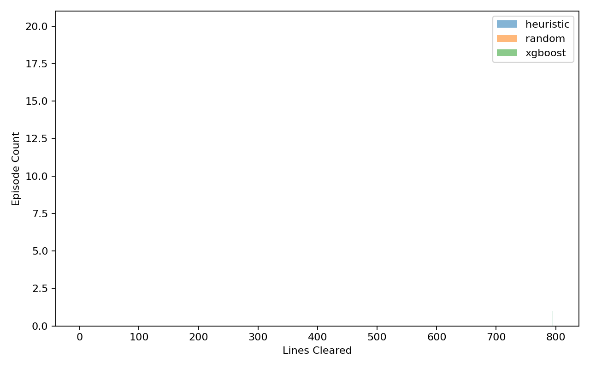
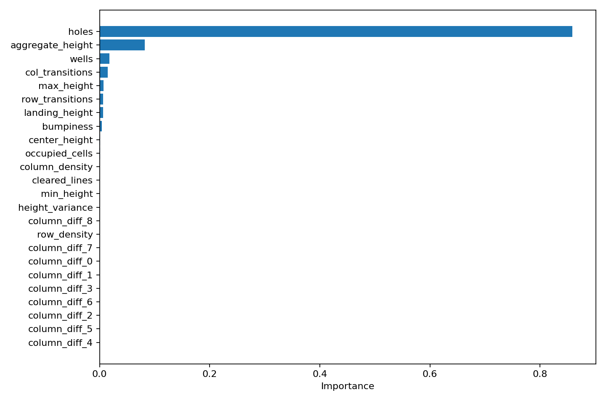

# Tetris AI: XGBoost-Based Game Playing Agent

<p align="center">
  
  
  
  
  
</p>

<p align="center">
  🌐 <a href="README.md">English</a> | <b>Vietnamese</b>
</p>

## Demo

<table align="center">
  <tr>
    <td align="center"><b>Mô hình XGBoost</b><br>(AI tự học)</td>
    <td align="center"><b>Thuật toán Heuristic</b><br>(Chuyên gia)</td>
    <td align="center"><b>Random</b><br>(Chơi bừa)</td>
  </tr>
  <tr>
    <td width="33%"></td>
    <td width="33%"></td>
    <td width="33%"></td>
  </tr>
</table>

## Dự án này có gì thú vị?

Dự án này dạy AI chơi Tetris không phải bằng cách bắt nó chơi đi chơi lại hàng triệu lần cho đến khi khôn ra (như cách Học Tăng Cường hay làm), mà bằng cách cho nó "nhìn lén" một cao thủ chơi vài trăm ván.

Cụ thể, thay vì nhìn vào từng điểm ảnh trên màn hình, AI (**XGBoost**) sẽ nhìn vào bàn cờ và tư duy theo kiểu không gian: *"Nước đi này tạo ra nhiều lỗ hổng quá, không được! Nước đi kia xóa được nhiều hàng, tuyệt vời!"* 

Chỉ bằng cách phân tích cấu trúc bàn cờ qua 200 ván chơi mẫu, AI đã tự tìm ra quy luật và chơi giỏi đến mức bất ngờ!

---

## Cách AI hoạt động (Dưới góc độ kỹ thuật)

### 1. AI nhìn nhận trò chơi ra sao?
Thay vì quyết định xem nên bấm nút `TRÁI`, `PHẢI`, hay `XUỐNG`, AI trong dự án này sẽ xem xét **tất cả các vị trí có thể đặt gạch**. Với mỗi khối gạch đang rơi, nó sẽ tính toán xem nếu rơi xuống đáy thì bàn cờ trông sẽ như thế nào. 
Nhiệm vụ của AI là chấm điểm từng viễn cảnh đó và chọn ra viễn cảnh điểm cao nhất.

### 2. Các chỉ số AI quan tâm (Feature Extraction)
Để chấm điểm một bàn cờ tương lai, AI sẽ tính toán nhanh các chỉ số sau:
- `landing_height`: Khối gạch nằm ở độ cao bao nhiêu?
- `lines_cleared`: Xóa được mấy hàng?
- `row_transitions` / `col_transitions`: Bàn cờ bị lởm chởm, đứt gãy nhiều không?
- `holes`: Có bao nhiêu ô trống bị bịt kín không thể nhét gạch vào được nữa?
- `wells`: Có bị kẹt ở những cái khe quá hẹp không?
- `bumpiness`: Độ nhấp nhô giữa các cột gạch.

### 3. Dạy AI như thế nào?
- **Thu thập dữ liệu:** Một thuật toán chuyên gia (được code bằng toán học tối ưu hóa) sẽ chơi game và sinh ra hàng ngàn vị trí thả gạch.
- **Học thuật toán:** Mô hình `XGBoost` sẽ nhìn vào các chỉ số kể trên và học cách dự đoán chính xác số điểm mà chuyên gia sẽ chấm cho nước đi đó.

---

## Đánh giá hiệu năng

Sau khi train, mô hình XGBoost đạt được hiệu suất khoảng ~85% so với chính thuật toán chuyên gia mà nó bắt chước. Điều này chứng tỏ các chỉ số (features) được chọn lọc ở trên là cực kỳ chính xác.

<p align="center">
  
  
</p>

*Trái: Biểu đồ so sánh cho thấy XGBoost vượt xa random và đuổi sát nút chuyên gia. Phải: Biểu đồ SHAP cho thấy AI tự nhận ra rằng `holes` (Lỗ hổng) và `bumpiness` (Độ nhấp nhô) là hai yếu tố chí mạng nhất quyết định sự sống còn trong game.*

---

## Hướng dẫn chạy thử

### 1. Cài Đặt
Tải code về và cài đặt môi trường bằng Conda:
```bash
git clone https://github.com/tuyenda2011/Tetris-AI-XGBoost-Based-Game-Playing-Agent.git
cd Tetris-AI-XGBoost-Based-Game-Playing-Agent
conda create -n tetris python=3.10 -y
conda activate tetris
pip install -r requirements.txt
```

### 2. Chạy toàn bộ quy trình (Pipeline)
Bạn có thể tự tay chạy lại quá trình sinh dữ liệu, train model và đánh giá AI:
```bash
# 1. Thu thập dữ liệu từ chuyên gia (Chạy đa luồng song song)
python scripts/generate_dataset.py --config configs/dataset_quality.yaml

# 2. Train mô hình XGBoost
python scripts/train_model.py --config configs/model_train.yaml

# 3. Đánh giá tốc độ và số điểm AI đạt được
python scripts/evaluate_agent.py --episodes 20 --max-pieces 2000 --seed 42
```

### 3. Tự mình xem AI chơi (Giao diện đồ họa)
Để tận mắt chứng kiến AI chơi Tetris siêu mượt mà, hãy chạy lệnh sau:
```bash
python scripts/play_gui.py
```
*(Bảng điều khiển: Dùng `LÊN`/`XUỐNG` để chọn người chơi, `ENTER` để bắt đầu, `SPACE` để tạm dừng, `M` để ra Menu, `ESC` để thoát)*
